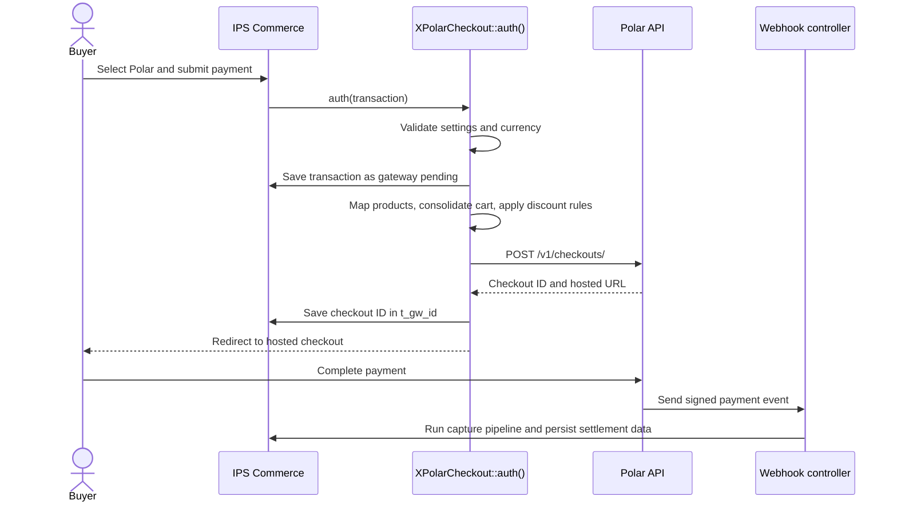
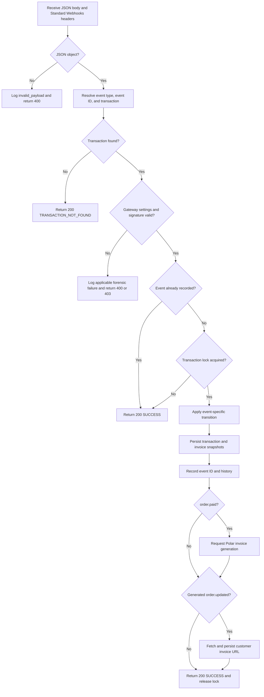
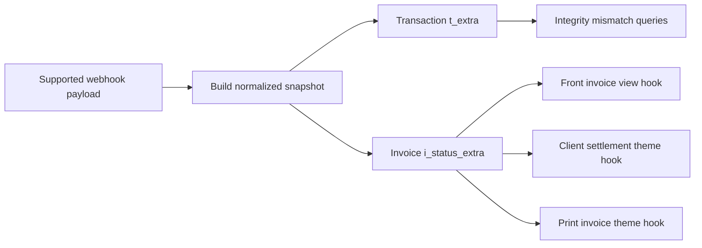
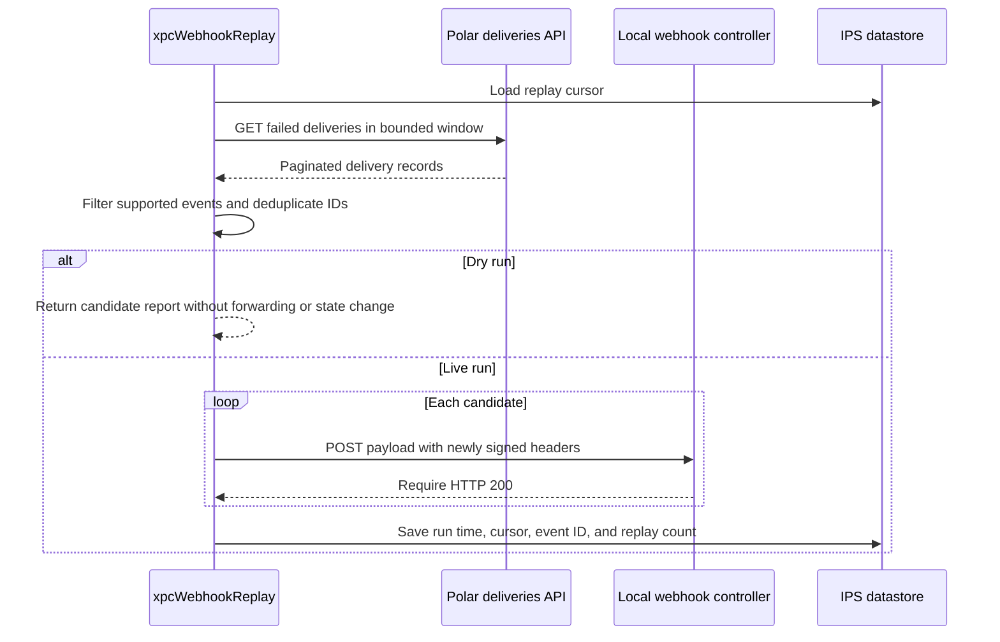

# X Polar Checkout Flow

This document describes the runtime entry points and event flows for IPS app `xpolarcheckout`.

## Related Documentation

- [GitHub Issues](https://github.com/XENNTEC-UG/ips4-xpolarcheckout/issues): open work items
- [README.md](README.md): purpose and source paths
- [ARCHITECTURE.md](ARCHITECTURE.md): components and data contracts
- [FEATURES.MD](FEATURES.MD): implemented capabilities
- [TEST_RUNTIME.md](TEST_RUNTIME.md): runtime verification checks

## Main Entry Points

| Entry point | Source | Responsibility |
| --- | --- | --- |
| Nexus gateway | `app-source/sources/XPolarCheckout/XPolarCheckout.php` | Settings, validity checks, checkout session creation, refunds, provider helpers |
| Front webhook controller | `app-source/modules/front/webhook/webhook.php` | Signature validation, transaction correlation, state transitions, snapshots, invoice generation |
| ACP integrity controller | `app-source/modules/admin/monitoring/integrity.php` | Health display, replay actions, forensic acknowledgment and deletion, endpoint event synchronization |
| ACP forensics controller | `app-source/modules/admin/monitoring/forensics.php` | Webhook failure records |
| ACP products controller | `app-source/modules/admin/monitoring/products.php` | Product mappings and bulk name synchronization |
| Replay task | `app-source/tasks/xpcWebhookReplay.php` | Failed delivery retrieval and signed local replay |
| Integrity task | `app-source/tasks/xpcIntegrityMonitor.php` | Local integrity notifications and forensic retention |
| Invoice view helper | `app-source/sources/Invoice/ViewHelper.php` | Settlement HTML and invoice detail enhancements |
| Hooks and extensions | `app-source/data/hooks.json`, `app-source/data/extensions.json` | Nexus registration, invoice output, coupon names, ACP profile block, notifications |

The front webhook URL is `index.php?app=xpolarcheckout&module=webhook&controller=webhook`.

## Checkout Flow

The success URL returns the buyer to the transaction URL with `pending=1`. It does not mark the invoice paid. Payment capture occurs when a supported signed webhook reports a paid or succeeded state.

For multi-item invoices, Polar is either hidden by `checkValidity()` when `single_item_only` is configured, or the payable items are consolidated into one product and one combined price. Negative invoice lines are excluded from the product price map and evaluated as an IPS discount.

## Webhook Flow

### Event Transitions

| Event | Code behavior |
| --- | --- |
| `order.created` | Store the order ID and set gateway pending unless the transaction is terminal |
| `order.paid` | Store the order ID and call `checkFraudRulesAndCapture()` unless already paid or refunded |
| `order.updated` | Apply paid, pending, partial refund, or full refund state from order fields |
| `order.refunded` | Derive partial or full refund state from order fields |
| `refund.created` | Acknowledge without changing transaction state |
| `refund.updated` | Apply partial or full refund state only when status is `succeeded` |
| `checkout.updated` | Keep `open` or `confirmed` pending, capture `succeeded`, refuse `failed` or `expired` unless terminal |

The signature input is `webhook-id.webhook-timestamp.raw-body`. The controller requires the three Standard Webhooks headers, rejects timestamps outside the 600 second window, and compares the HMAC-SHA256 signature after normalizing the configured secret.

## Snapshot and Display Flow

Snapshots contain only fields resolved from the event payload plus calculated display and IPS comparison fields. A later event preserves a previously fetched customer invoice URL when its own payload does not include one.

## Replay and Monitoring Flow

`xpcWebhookReplay` runs every 15 minutes. Its configured lookback, overlap, and event limit are clamped in code. It also enforces 10 pages and 120 seconds per run.

`xpcIntegrityMonitor` runs every 5 minutes. It evaluates local log and snapshot statistics through the admin notification extension. Once per day it deletes `xpc_webhook_forensics` rows older than 90 days. Provider endpoint drift is fetched by the ACP integrity controller, not by the scheduled integrity task.

## Implementation Constraints

- Production API base: `https://api.polar.sh/v1`
- Sandbox API base: `https://sandbox-api.polar.sh/v1`
- Checkout, product, refund, and discount creation calls use endpoint-specific trailing slash forms in the gateway source.
- Checkout currency must match the configured presentment currency when one is stored.
- Replay reads failed deliveries from `/webhooks/deliveries` and forwards them through the same local webhook controller used for live events.
